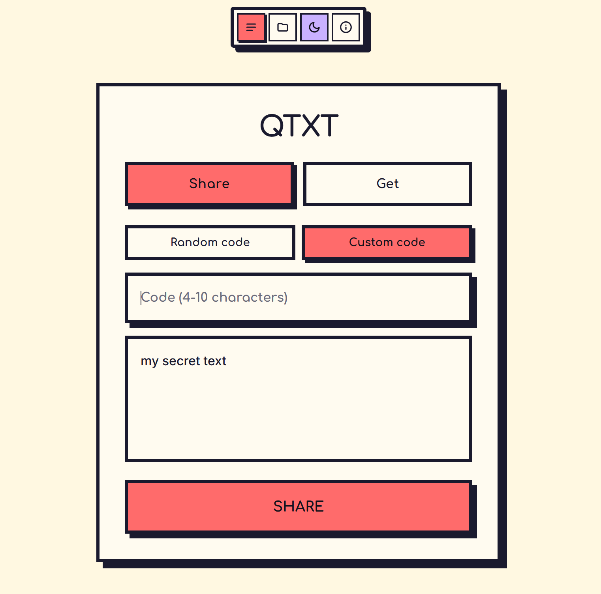

# qtxt

Anonymous text sharing via short codes. Paste text, get a code, share it. Gone in 10 minutes.



## How it works

1. Paste your text (or upload a file up to 20KB)
2. Get a short code
3. Share the code — whoever has it can read the text
4. Text auto-deletes after 10 minutes

No accounts, no history, no tracking.

## Tech

Next.js 16, React 19, TailwindCSS v4, Vercel KV. Auto-detects language (ru/en).

## Run locally

```bash
npm install
npm run dev
```

Requires Vercel KV env vars (`KV_URL`, `KV_REST_API_URL`, `KV_REST_API_TOKEN`, `KV_REST_API_READ_ONLY_TOKEN`).

---

# qtxt

Анонимный обменник текстом по короткому коду. Вставь текст — получи код — поделись. Через 10 минут удалится.

1. Вставь текст (или загрузи файл до 20KB)
2. Получи короткий код
3. Поделись кодом — кто угодно сможет прочитать текст
4. Текст удаляется автоматически через 10 минут

Никаких аккаунтов, истории и трекинга.

```bash
npm install
npm run dev
```

Нужны переменные Vercel KV: `KV_URL`, `KV_REST_API_URL`, `KV_REST_API_TOKEN`, `KV_REST_API_READ_ONLY_TOKEN`.
